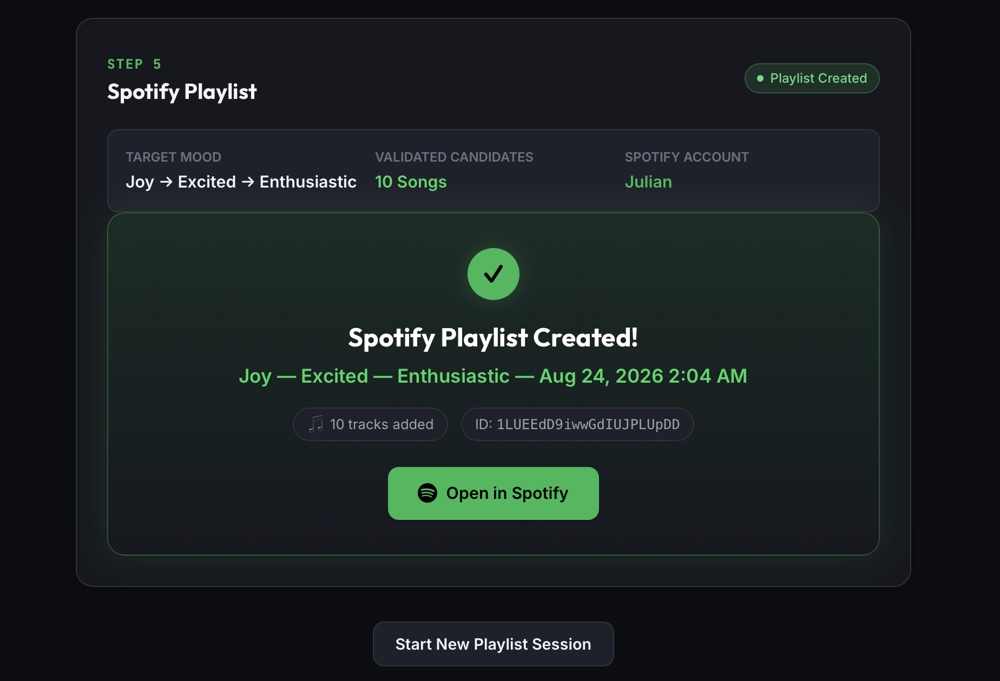
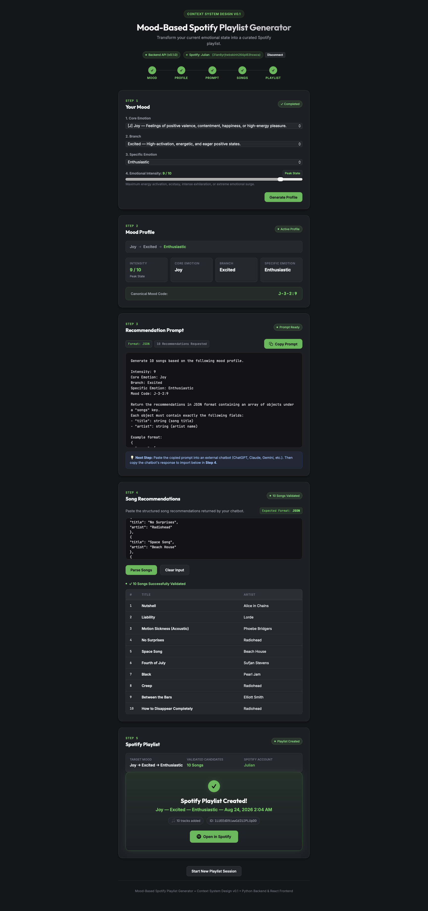

# Mood-Based Spotify Playlist Generator

> A deterministic application that turns a structured mood profile and AI-generated song recommendations into a verified Spotify playlist.



A reference implementation demonstrating **Context System Design (v0.1)**.

---

## Overview

The **Mood-Based Spotify Playlist Generator** creates personalized Spotify playlists by combining structured human emotional context with external AI song recommendations:

1. **Deterministic Mood Selection:** Guides the user through a canonical 4-level taxonomy to determine an authoritative **Mood Profile** and canonical mood code (e.g. `J-3-1:8`).
2. **Machine-Readable Prompt Generation:** Produces a structured prompt requesting song recommendations in `json`, `csv`, or `yaml` from an external chatbot.
3. **Song List Ingestion & Validation:** Parses and validates the structured song recommendations from the chatbot (via interactive paste or file).
4. **Deterministic Spotify Resolution & Playlist Creation:** Resolves candidate tracks against Spotify's catalog and creates a named Spotify playlist (e.g., `Joy — Excited — Energetic — Aug 24, 2026 1:15 AM`) populated with all resolved tracks, reporting any unresolved songs clearly.

The application provides two complementary user interfaces sharing the exact same Python business logic:
- **Web Graphical User Interface (React + Vite)**: A modern, dark-themed visual presentation layer.
- **Interactive Command-Line Interface (CLI)**: A lightweight terminal-based wizard.

---

## Context System Design

This project serves as a reference implementation for the **[Context System Design Framework](frameworks/context-system-design-v0.1.md)**.

Rather than treating context as ad-hoc prompt engineering or delegating emotional reasoning to an opaque LLM, Context System Design models context intentionally through clear authority boundaries:

```text
Context Generation      User explicitly selects mood (Core Emotion → Branch → Specific Emotion → Intensity)
        ↓
Context Modeling        Application structures choices into a canonical MoodProfile & code (e.g. J-3-1:8)
        ↓
Prompt Assembly         Deterministic prompt template is populated with MoodProfile & config.json settings
        ↓
External AI Reasoning   External chatbot produces machine-readable song recommendations (JSON/CSV/YAML)
        ↓
Song Ingestion          Application parses and validates the structured song list (src/song_parser.py)
        ↓
External Validation     Application resolves song candidates against Spotify Web API (src/spotify.py)
        ↓
Context Delivery        Application creates and populates the Spotify playlist
```

### Core Authority Principles

1. **The User is the Authority on Their Emotion:** The user explicitly chooses their emotional state and intensity. The application does not attempt to "guess" emotions through sentiment analysis or conversational LLM estimation.
2. **The Chatbot is the Authority on Musical Reasoning:** Song recommendations are reasoned by an external chatbot (ChatGPT, Claude, Gemini, etc.) using strict output contracts (`json`, `csv`, `yaml`).
3. **The Application is the Context Assembler & Validator:** Raw chatbot responses are treated as untrusted candidates until parsed, structured, and validated by the backend domain model.
4. **Spotify is the Authority on Catalog & Tracks:** Songs are verified deterministically against Spotify's Search API before playlist creation, eliminating hallucinated tracks.
5. **Zero Logic Duplication:** Both the React GUI and CLI rely on the same Python domain models, taxonomy, and Spotify services.

*For complete design specifications, see [System Architecture Design](designs/Mood-Based%20Spotify%20Playlist%20Generator.md) and [GUI Design](designs/Mood-Based-Spotify-Playlist-Generator-GUI.md).*

---

## Architecture

```text
                         USER
                           │
              ┌────────────┴────────────┐
              │                         │
              ▼                         ▼
      React GUI (frontend/)       Interactive CLI (main.py)
              │                         │
              │ HTTP (JSON REST)        │ Direct Python Calls
              ▼                         ▼
      Python API Server (src/server.py) │
              │                         │
              └────────────┬────────────┘
                           ▼
  ┌──────────────────────────────────────────────────┐
  │         Shared Python Application Logic          │
  │                                                  │
  │  • Taxonomy Traversal (src/taxonomy.py)          │
  │  • Context Modeling & Data Models (src/models.py)│
  │  • Machine-Readable Prompts (src/prompt.py)      │
  │  • Song Parser & Ingestion (src/song_parser.py)  │
  │  • Deterministic Spotify Client (src/spotify.py) │
  └──────────────┬───────────────────┬───────────────┘
                 │                   │
  ┌──────────────┴──────────────┐    │
  ▼                             ▼    ▼
Mood Taxonomy                Config & Secrets
context/mood-taxonomy.json   • config.json (song_count, format)
                             • Environment (SPOTIFY_CLIENT_ID, ...)
                                     │
                                     ▼
                           Recommendation Prompt
                             (JSON / CSV / YAML)
                                     │
                                     ▼ (Outside Application)
                             External Chatbot
                        (ChatGPT, Claude, Gemini)
                                     │
                                     ▼
                          Song Recommendations
                             (Raw Song List)
                                     │
                                     ▼
                            Song Parser & Validator
                             (src/song_parser.py)
                                     │
                                     ▼
                             Spotify Web API
                           (api.spotify.com)
                                     │
                                     ▼
                             Spotify Playlist
                   (Populated with Resolved Tracks)
```

---

## Security & Credential Isolation

Security and credential protection are central design constraints of the application:

- **Backend Credential Isolation:** Spotify client credentials (`SPOTIFY_CLIENT_ID`, `SPOTIFY_CLIENT_SECRET`) and access tokens are managed exclusively by the Python backend via environment variables and never exposed to the frontend browser application.
- **CSRF State Verification:** The local OAuth authorization flow generates cryptographically secure `state` tokens (`secrets.token_urlsafe(24)`) with automatic expiration to prevent CSRF and session confusion.
- **Restricted Token Cache:** Cached tokens (`.cache-spotify.json`) are stored with strict owner-only file permissions (`0600` / `-rw-------`) and are ignored by Git.
- **Safe Input Parsing:** Song ingestion parsers (`src/song_parser.py`) use zero-eval string parsing and safe YAML handling, rejecting dangerous executable structures.
- **Payload Limits:** The backend API server enforces strict request body limits (`1 MB`) to prevent memory exhaustion denial-of-service.
- **Automated Security Suite:** A dedicated test suite ([`tests/test_security.py`](tests/test_security.py)) continuously validates credential protection, OAuth CSRF rejection, and safe input parsing.

---

## Configuration & Environment Variables

### Application Settings (`config.json`)
Managed in [`config.json`](config.json) at the root of the project:

```json
{
  "song_count": 10,
  "output_format": "json"
}
```

* `song_count`: Number of songs requested from the chatbot (default: `10`).
* `output_format`: Machine-readable format requested: `"json"`, `"csv"`, or `"yaml"`.

### Spotify Credentials Setup

Set the following environment variables (or copy [`set-spotify-env.example.sh`](set-spotify-env.example.sh)):

```bash
cp set-spotify-env.example.sh set-spotify-env.sh
```

Edit `set-spotify-env.sh` with your Spotify Developer credentials:

```bash
export SPOTIFY_CLIENT_ID="your_spotify_client_id_here"
export SPOTIFY_CLIENT_SECRET="your_spotify_client_secret_here"
export SPOTIFY_REDIRECT_URI="http://127.0.0.1:8888/callback"
```

Source the script in your active shell:

```bash
source ./set-spotify-env.sh
```

---

## Usage

### 1. Web Graphical User Interface (React + Vite)

The React GUI runs locally and communicates with the Python backend REST API:

```bash
# Terminal 1: Start the Python Backend API Server
source ./set-spotify-env.sh
python3 main.py --serve

# Terminal 2: Start the React Frontend Dev Server
cd frontend
npm run dev
```

Open your browser at `http://localhost:3000`.

### 2. Interactive CLI Mode

Run the complete end-to-end terminal wizard:

```bash
source ./set-spotify-env.sh
python3 main.py
```

### 3. Direct Command-Line & File Import

Generate a prompt or import a saved song list file directly:

```bash
# Generate prompt from a mood code
python3 main.py --code J-3-1:8

# Direct import and playlist creation
python3 main.py --code J-3-1:8 --import-songs path/to/songs.json

# Dump full mood taxonomy
python3 main.py --dump-taxonomy
```

---

## Development Methodology

This project was built following an incremental, task-driven development methodology:

1. **Architectural Grounding:** High-level framework and design documents established domain models, taxonomy definitions, and architectural boundaries before coding.
2. **Incremental Task Execution:** The application was built across 22 sequential tasks ([`tasks/`](tasks/)), each with clear scope, acceptance criteria, and verification steps executed by an autonomous AI coding agent.
3. **Continuous Verification:** Every task was validated against automated unit test suites and production bundle builds before progressing to subsequent tasks.
4. **Adaptive Refinement:** Implementation realities (such as non-blocking GUI OAuth separation, API rate limits, and CSRF state management) were refined collaboratively across task iterations.

---

## Testing & Build Verification

Run the Python unit and security test suite:
```bash
python3 -m unittest discover -s tests
```
*Current test status: **88/88 tests passing**.*

Build the React frontend production bundle:
```bash
cd frontend
npm run build
```
*Current build status: **Built cleanly in ~350ms**.*

---

## Project Structure

```text
.
├── AGENTS.md                  # Operating guidelines and architectural rules for AI agents
├── README.md                  # Comprehensive project documentation
├── config.json                # User application configuration (song_count, output_format)
├── set-spotify-env.example.sh # Safe template for Spotify API credentials
├── main.py                    # Root entrypoint (CLI and --serve backend)
├── frontend/                  # React + Vite Graphical User Interface
│   ├── package.json           # Frontend dependencies
│   ├── vite.config.js         # Vite configuration with backend API proxy
│   ├── index.html             # HTML entrypoint
│   └── src/
│       ├── main.jsx           # React DOM root
│       ├── App.jsx            # Application shell & 5-step workflow stepper
│       ├── index.css          # Dark theme design system tokens & styles
│       ├── components/        # Focused UI section components
│       │   ├── MoodSelection.jsx   # Step 1: Mood taxonomy dropdowns & intensity slider
│       │   ├── MoodProfileView.jsx # Step 2: Canonical mood profile summary card
│       │   ├── PromptView.jsx      # Step 3: Machine-readable prompt & copy action
│       │   ├── SongImport.jsx      # Step 4: Chatbot response textarea & parser
│       │   └── SpotifyPlaylist.jsx # Step 5: Track resolution & playlist creation
│       └── api/
│           └── client.js      # Backend REST API client
├── src/                       # Python core domain logic
│   ├── __init__.py
│   ├── config.py              # Configuration loader and validator
│   ├── models.py              # MoodProfile, SongRecommendation, ResolvedTrack models
│   ├── taxonomy.py            # Taxonomy traversal, validation, and code parsing
│   ├── prompt.py              # Machine-readable prompt templates (JSON, CSV, YAML)
│   ├── song_parser.py         # Ingestion and validation for JSON, CSV, and YAML song lists
│   ├── spotify.py             # Spotify authentication, search resolution, and playlist CRUD
│   ├── server.py              # HTTP REST API server & OAuth callback listener
│   ├── mood_selection.py      # Interactive CLI wizard and import coordinator
│   └── cli.py                 # CLI argument parsing
├── tests/                     # Automated test suites
│   ├── __init__.py
│   ├── test_config.py         # Configuration tests
│   ├── test_taxonomy.py       # Taxonomy and code parsing tests
│   ├── test_prompt.py         # Prompt template rendering tests
│   ├── test_song_parser.py    # Song list parsing and validation tests
│   ├── test_spotify.py        # Spotify API and track resolution mock tests
│   ├── test_server.py         # Backend REST API endpoint tests
│   ├── test_mood_selection.py # Interactive CLI flow tests
│   └── test_security.py       # Security, OAuth CSRF, and credential isolation tests
├── context/                   # Canonical domain context and schemas
│   ├── mood-taxonomy.json     # Canonical mood taxonomy and intensity scales
│   └── schemas/
│       └── mood-selection.json# JSON schema for MoodProfile
├── frameworks/                # Context System Design framework specification
│   └── context-system-design-v0.1.md
├── designs/                   # Architecture and UI design documents
│   ├── Mood-Based Spotify Playlist Generator.md
│   └── Mood-Based-Spotify-Playlist-Generator-GUI.md
├── docs/                      # Screenshots & visual assets
│   └── images/
│       ├── full_app.png       # Complete 5-step workflow screenshot
│       └── step_5.png         # Step 5 playlist creation screenshot
└── tasks/                     # Task specifications (Tasks 001–022)
```

---

## Full Application Workflow

The complete five-step workflow in the React GUI, from mood selection to Spotify playlist creation:

